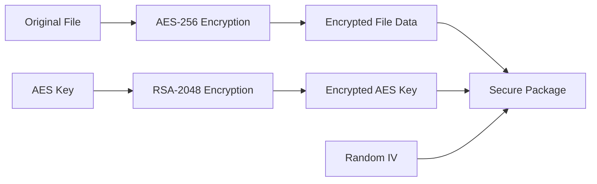
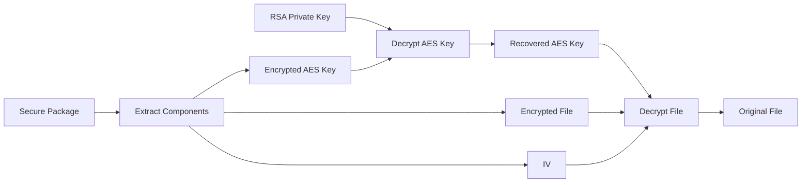

# 🔐 FileSecure - Secure File Transfer Protocol

<div align="center">


**A professional web-based file encryption system using hybrid cryptography**

[Demo](#-demo) • [Features](#-features) • [Installation](#-installation) • [Usage](#-usage) • [Security](#-security)

</div>

---

## 🌟 Overview

FileSecure is a cutting-edge, client-side file encryption application that combines the best of both worlds: the **speed of symmetric encryption (AES-256-GCM)** with the **security of asymmetric encryption (RSA-2048)**. All encryption happens directly in your browser—no servers, no data collection, complete privacy.

### 🎯 Why FileSecure?

- **🔒 Military-Grade Encryption**: RSA-2048 + AES-256-GCM
- **🌐 100% Client-Side**: Zero-knowledge architecture
- **🚀 No Setup Required**: Works instantly in any modern browser
- **🎨 Beautiful UI**: Modern, responsive design
- **📱 Cross-Platform**: Works on desktop, tablet, and mobile
- **🔓 Open Source**: Fully transparent and auditable code

---

## ✨ Features

### 🔐 Core Security Features
- **Hybrid Encryption System**
  - RSA-2048 with OAEP padding for key exchange
  - AES-256-GCM for file encryption
  - Random IV (Initialization Vector) for each encryption
  
- **Zero-Knowledge Architecture**
  - All processing happens in your browser
  - No server-side storage or transmission
  - Keys never leave your device
  - Complete privacy and security

### 🎨 User Experience
- **Intuitive Interface**
  - Drag & drop file upload
  - Real-time encryption/decryption progress
  - Step-by-step status updates
  - Visual key status indicators

- **Key Management**
  - Generate RSA-2048 key pairs
  - Generate AES-256 keys
  - Export keys for backup
  - View and copy keys to clipboard
  - Secure key visualization

### 📊 Advanced Features
- **Encryption History**: Track recently encrypted files
- **File Metadata**: Original and encrypted file size comparison
- **Package Format**: Secure .secure file format
- **Multi-File Support**: Encrypt any file type
- **Mobile Responsive**: Works seamlessly on all devices

---

## 🚀 Quick Start

### Prerequisites
- Node.js 14+ and npm
- Modern web browser (Chrome 37+, Firefox 34+, Safari 11+, Edge 79+)

### Installation
```bash
# Clone the repository
git clone https://github.com/prajwal9773/FileSecure.git

# Navigate to project directory
cd FileSecure

# Install dependencies
npm install

# Start development server
npm start
```

The application will open at `http://localhost:3000`

### Build for Production
```bash
# Create optimized production build
npm run build

# The build folder contains your production-ready app
```

---

## 📖 Usage

### 1️⃣ Generate Cryptographic Keys
```
Step 1: Click "Generate RSA-2048" button
Step 2: Click "Generate AES-256" button
Step 3: Wait for green checkmarks to appear
```

### 2️⃣ Encrypt a File
```
Step 1: Go to the "Encrypt" tab
Step 2: Drag & drop your file OR click "Browse Files"
Step 3: Click "Encrypt File Now"
Step 4: Download the encrypted .secure package
```

### 3️⃣ Decrypt a File
```
Step 1: Go to the "Decrypt" tab
Step 2: Click "Select Package File" and choose your .secure file
Step 3: Click "Decrypt File Now"
Step 4: Download your original file
```

### 4️⃣ Share Encrypted Files
```
Method 1: Share the .secure file via any channel (email, cloud, USB)
Method 2: Recipient needs the RSA private key to decrypt
Method 3: For maximum security, share keys through a separate secure channel
```

---

## 🔬 How It Works

### Encryption Process


1. **Generate Random AES Key**: A unique 256-bit AES key is created
2. **Encrypt File with AES**: Your file is encrypted using AES-256-GCM (fast for large files)
3. **Encrypt AES Key with RSA**: The AES key is encrypted using RSA-2048 public key
4. **Package Everything**: Encrypted file + Encrypted AES key + IV = .secure package

### Decryption Process


1. **Load Secure Package**: Import the .secure file
2. **Decrypt AES Key**: Use RSA-2048 private key to recover the AES key
3. **Decrypt File**: Use the recovered AES key to decrypt the file
4. **Restore Original**: Get back your original file, byte-for-byte identical

---

## 🛡️ Security

### Encryption Standards

| Component | Algorithm | Key Size | Standard |
|-----------|-----------|----------|----------|
| Asymmetric | RSA-OAEP | 2048-bit | PKCS#1 v2.1 |
| Symmetric | AES-GCM | 256-bit | FIPS 197 |
| Hash | SHA-256 | 256-bit | FIPS 180-4 |

### Security Features

✅ **Authenticated Encryption**: AES-GCM provides both confidentiality and authenticity  
✅ **Random IV**: Each encryption uses a unique initialization vector  
✅ **Web Crypto API**: Uses browser's native cryptographic functions  
✅ **No Key Storage**: Keys exist only in memory during session  
✅ **OAEP Padding**: Prevents RSA encryption attacks  
✅ **Zero Network Requests**: Everything runs locally  

### Security Best Practices

⚠️ **Important Security Notes:**

1. **Private Key Protection**: Keep your RSA private key secure and never share it
2. **Key Backup**: Export and backup your keys securely if needed
3. **Secure Channels**: Share keys and encrypted files through different channels
4. **Production Use**: For enterprise use, implement proper key management systems
5. **Browser Security**: Always use HTTPS in production environments

---

## 🏗️ Technical Architecture

### Technology Stack
```
Frontend Framework:   React 18
Styling:             Tailwind CSS
Icons:               Lucide React
Cryptography:        Web Crypto API
Build Tool:          Create React App
```

### Project Structure
```
FileSecure/
├── public/
│   ├── index.html
│   └── favicon.ico
├── src/
│   ├── App.js              # Main application component
│   ├── index.js            # Entry point
│   ├── index.css           # Global styles (Tailwind)
│   └── ...
├── package.json
├── tailwind.config.js
├── README.md
└── .gitignore
```

### Key Components

- **Key Generation Module**: RSA and AES key pair generation
- **Encryption Engine**: Hybrid encryption implementation
- **Decryption Engine**: Reverse hybrid decryption
- **File Handler**: Drag & drop and file selection
- **UI Components**: Tabs, status indicators, history tracking

---

## 🧪 Testing

### Manual Testing
```bash
# Test with different file types
✅ Text files (.txt, .md)
✅ Images (.jpg, .png, .gif)
✅ Documents (.pdf, .docx)
✅ Archives (.zip, .tar)
✅ Videos (.mp4, .avi)
```

### Verification Steps

1. Encrypt a file and download the .secure package
2. Decrypt the package and download the original file
3. Compare checksums: `shasum original.txt decrypted.txt`
4. Files should be byte-for-byte identical

---

## 🚢 Deployment

### Deploy to Vercel
```bash
# Install Vercel CLI
npm i -g vercel

# Deploy
vercel
```

### Deploy to Netlify
```bash
# Build the app
npm run build

# Drag and drop the 'build' folder to Netlify
```

### Deploy to GitHub Pages
```bash
# Install gh-pages
npm install --save-dev gh-pages

# Add to package.json
"homepage": "https://prajwal9773.github.io/FileSecure",
"scripts": {
  "predeploy": "npm run build",
  "deploy": "gh-pages -d build"
}

# Deploy
npm run deploy
```

---

## 🤝 Contributing

Contributions are welcome! Please follow these steps:

1. Fork the repository
2. Create your feature branch (`git checkout -b feature/AmazingFeature`)
3. Commit your changes (`git commit -m 'Add some AmazingFeature'`)
4. Push to the branch (`git push origin feature/AmazingFeature`)
5. Open a Pull Request

### Development Guidelines

- Follow React best practices
- Maintain code readability and documentation
- Test thoroughly before submitting PRs
- Update README if adding new features

---

## 📝 Roadmap

### Planned Features

- [ ] **Password-based Encryption**: Add password-protected encryption option
- [ ] **Batch Processing**: Encrypt multiple files at once
- [ ] **Key Import/Export**: Import existing RSA keys
- [ ] **Cloud Integration**: Optional cloud storage integration
- [ ] **File Compression**: Compress before encryption
- [ ] **Progress Bar**: Detailed progress for large files
- [ ] **Dark/Light Theme**: Theme customization
- [ ] **Multi-language Support**: Internationalization

---

## 📄 License

This project is licensed under the MIT License - see the [LICENSE](LICENSE) file for details.
```
MIT License

Copyright (c) 2024 Prajwal

Permission is hereby granted, free of charge, to any person obtaining a copy
of this software and associated documentation files (the "Software"), to deal
in the Software without restriction, including without limitation the rights
to use, copy, modify, merge, publish, distribute, sublicense, and/or sell
copies of the Software, and to permit persons to whom the Software is
furnished to do so, subject to the following conditions:

The above copyright notice and this permission notice shall be included in all
copies or substantial portions of the Software.

THE SOFTWARE IS PROVIDED "AS IS", WITHOUT WARRANTY OF ANY KIND, EXPRESS OR
IMPLIED, INCLUDING BUT NOT LIMITED TO THE WARRANTIES OF MERCHANTABILITY,
FITNESS FOR A PARTICULAR PURPOSE AND NONINFRINGEMENT.
```

---

## 👤 Author

**Prajwal**

- GitHub: [@prajwal9773](https://github.com/prajwal9773)
- Project Link: [https://github.com/prajwal9773/FileSecure](https://github.com/prajwal9773/FileSecure)

---

## 🙏 Acknowledgments

- [Web Crypto API](https://developer.mozilla.org/en-US/docs/Web/API/Web_Crypto_API) - Browser cryptography
- [React](https://reactjs.org/) - UI framework
- [Tailwind CSS](https://tailwindcss.com/) - Styling
- [Lucide Icons](https://lucide.dev/) - Beautiful icons
- Cryptography community for security standards

---

## 📞 Support

If you encounter any issues or have questions:

1. Check the [Issues](https://github.com/prajwal9773/FileSecure/issues) page
2. Create a new issue if your problem isn't already listed
3. Provide detailed information about the problem

---

## ⭐ Show Your Support

If you find this project useful, please consider:

- ⭐ Starring the repository
- 🐛 Reporting bugs
- 💡 Suggesting new features
- 🔀 Contributing code

---

<div align="center">

**Made with ❤️ and 🔐 by Prajwal**

*Secure today, protected tomorrow*

</div>
